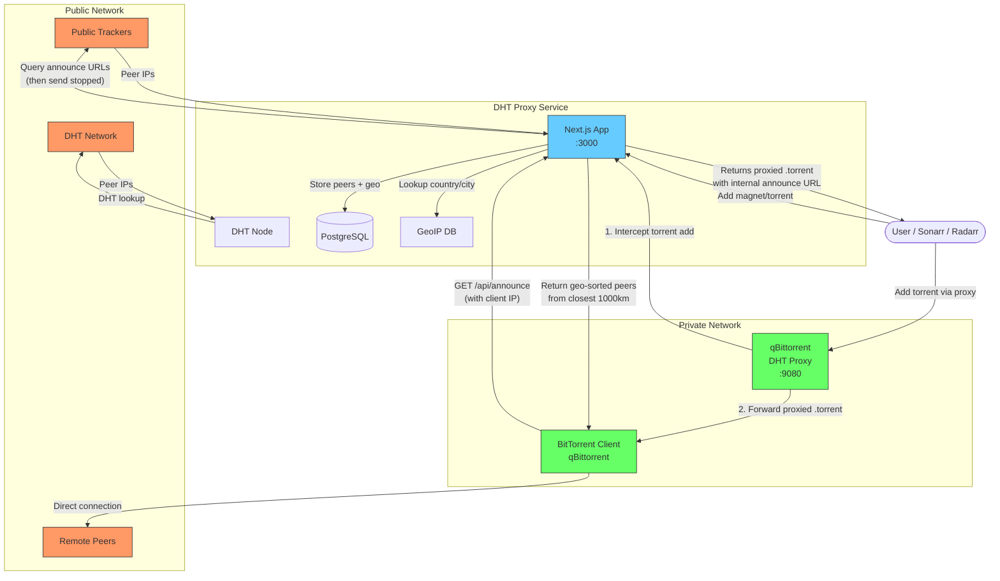
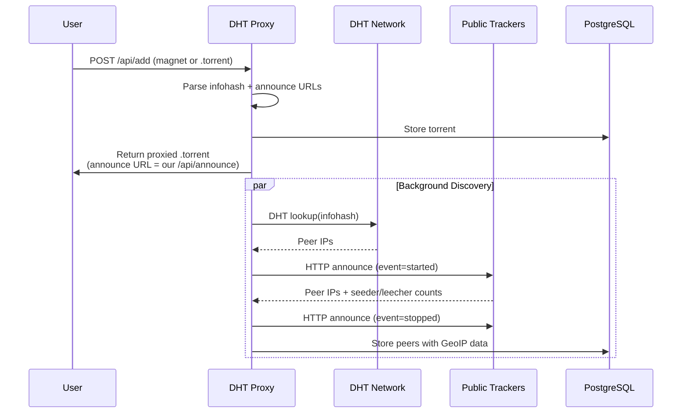
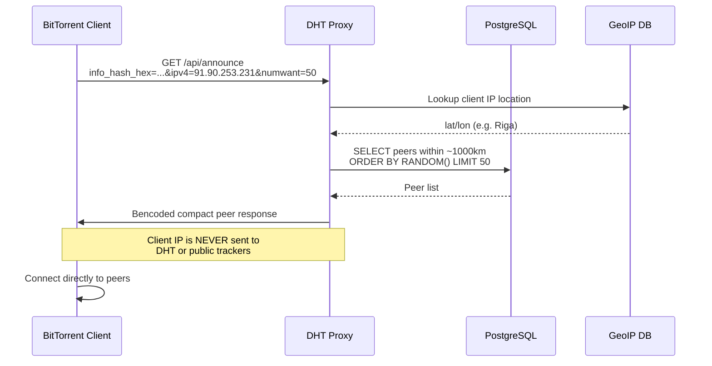
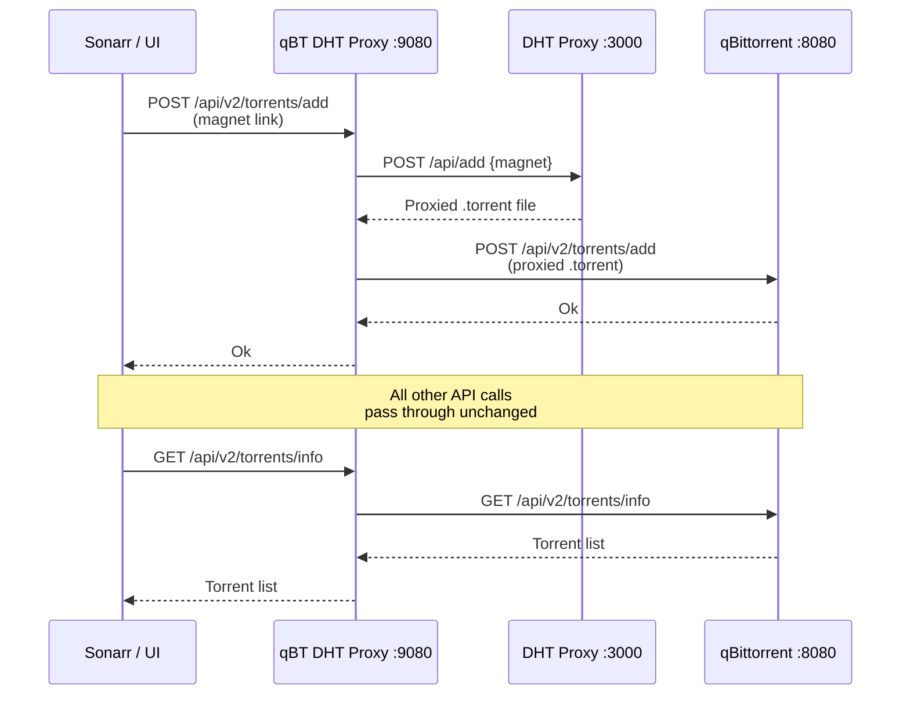

# DHT Proxy

Privacy-preserving BitTorrent peer relay. Accepts magnet links or torrent files, crawls DHT and original trackers for peers, and relays them to downstream clients via an internal announce endpoint — without exposing client IPs to the public network.

## How it works



### Data flow: Adding a torrent



### Data flow: Announcing (client gets peers)



### Data flow: qBittorrent proxy



## Setup

### Prerequisites

- [Bun](https://bun.sh/) v1.3+
- Docker & Docker Compose (for PostgreSQL)

### 1. Start PostgreSQL

```bash
docker compose up -d db
```

### 2. Configure environment

```bash
cp .env.example .env.local
# Edit .env.local with your values (OIDC, secrets, etc.)
```

### 3. Install dependencies

```bash
bun install
```

### 4. Generate & run database migrations

```bash
# Generate migration files from schema changes:
bun run db:generate

# Apply migrations to the database:
bun run db:migrate
```

**Important:** Always use the `bun run db:*` scripts from `package.json` for database operations. They automatically load `.env.local` via `bun --env-file`. Never run `drizzle-kit` directly or use raw SQL — the migration journal must stay in sync.

### 5. Run the dev server

```bash
bun run dev
```

The app starts at `http://localhost:3000`. On startup, `instrumentation.ts` automatically:
- Runs pending database migrations
- Starts the DHT node
- Starts background peer crawling (every 5 min)
- Starts expired torrent cleanup (every 1 hour)
- Cleans up stale peers not seen in the last hour

## Scripts

| Script | Description |
|--------|-------------|
| `bun run dev` | Start dev server with Turbopack |
| `bun run build` | Production build |
| `bun run start` | Start production server |
| `bun run lint` | Lint with Biome |
| `bun run lint:fix` | Auto-fix lint issues |
| `bun run test` | Run unit tests |
| `bun run db:generate` | Generate migration from schema changes |
| `bun run db:migrate` | Apply pending migrations |
| `bun run db:push` | Push schema directly (dev only, skips migrations) |
| `bun run db:studio` | Open Drizzle Studio |

## Architecture

- **Next.js 16** (App Router, Bun runtime, Turbopack)
- **Drizzle ORM** + PostgreSQL
- **Better Auth** with Authentik OIDC
- **shadcn/ui** components (sidebar layout, data tables)
- **Biome** for linting/formatting
- **bittorrent-dht** for DHT peer discovery
- **MaxMind GeoLite2** for IP geolocation (country flags, distance sorting)
- **bencode** for BitTorrent protocol encoding

### Key endpoints

| Endpoint | Auth | Description |
|----------|------|-------------|
| `POST /api/add` | Public or Bearer token | Submit magnet/torrent, get proxied .torrent back |
| `GET /api/announce` | Public | BitTorrent tracker announce (geo-sorted peers) |
| `GET /api/scrape` | Public | BitTorrent tracker scrape |
| `GET /api/torrents` | Admin | List all tracked torrents |
| `GET /api/torrents/[id]` | Admin | Torrent detail |
| `GET /api/torrents/[id]/peers` | Admin | Paginated peer list with geo data |
| `POST /api/torrents/[id]/recrawl` | Admin | Trigger manual DHT + tracker crawl |
| `DELETE /api/torrents/[id]` | Admin | Remove torrent and its peers |
| `GET/PUT /api/settings` | Admin | Read/update settings (TTL, etc.) |

### Access control

Set `DHT_PROXY_PUBLIC=false` to require authentication:
- **UI**: Redirects to OIDC login
- **API**: Requires `Authorization: Bearer <DHT_PROXY_API_TOKEN>` header

### Peer management

- Peers are discovered via DHT and original tracker announce URLs
- Each peer is enriched with GeoIP data (country, lat/lon) on discovery
- Stale peers (not seen in 1 hour) are automatically cleaned up
- Announce endpoint returns peers geo-sorted by proximity to the requesting client
- Admin UI shows peers with country flags, sorted by distance, with infinite scroll

### DHT node persistence

The DHT routing table is persisted to `data/dht-nodes.json` on shutdown (SIGINT/SIGTERM) and restored on startup for fast bootstrap.

## Docker

Docker Compose uses a base + overlay pattern. The `.env` file sets `COMPOSE_FILE` and `COMPOSE_PROJECT_NAME`.

```
docker/
  docker-compose.base.yml   # Core service definitions
  docker-compose.dev.yml    # Dev: exposes ports, stubs app (runs on host)
  docker-compose.prod.yml   # Prod: persistent volumes, Traefik, watchtower
  Dockerfile                # Multi-stage Bun build
```

### Development

`.env` is pre-configured for dev (`base + dev`). The app runs on the host, Docker provides only Postgres and GeoIP updates:

```bash
docker compose up -d        # Start db + geoipupdate
bun run dev                  # Run app on host
```

### Production

Create `.env.prod` with production values and override `COMPOSE_FILE`:

```bash
COMPOSE_FILE=docker/docker-compose.base.yml:docker/docker-compose.prod.yml
```

Then:

```bash
docker compose --env-file .env.prod up -d
```

## qBittorrent DHT Proxy

A separate proxy service that sits between your torrent management apps (Sonarr, Radarr, or browser) and qBittorrent. It intercepts torrent additions and routes them through DHT Proxy automatically.

See [qbittorrent-dht-proxy/README.md](qbittorrent-dht-proxy/README.md) for setup instructions.
